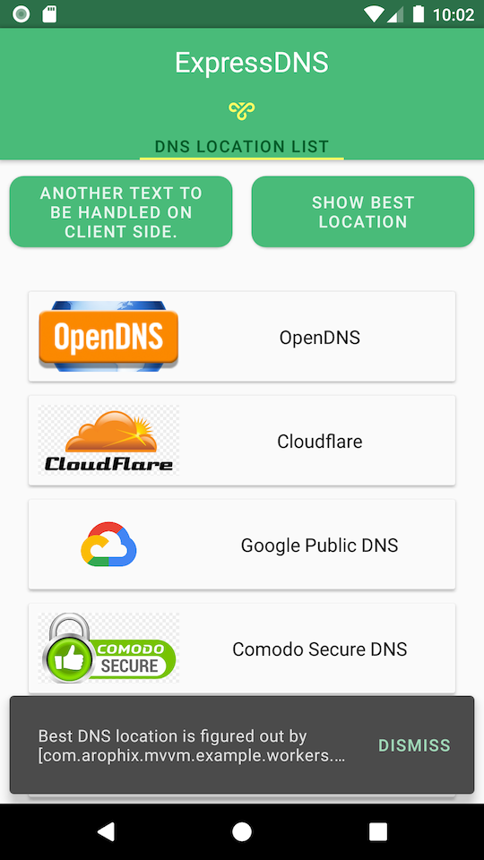
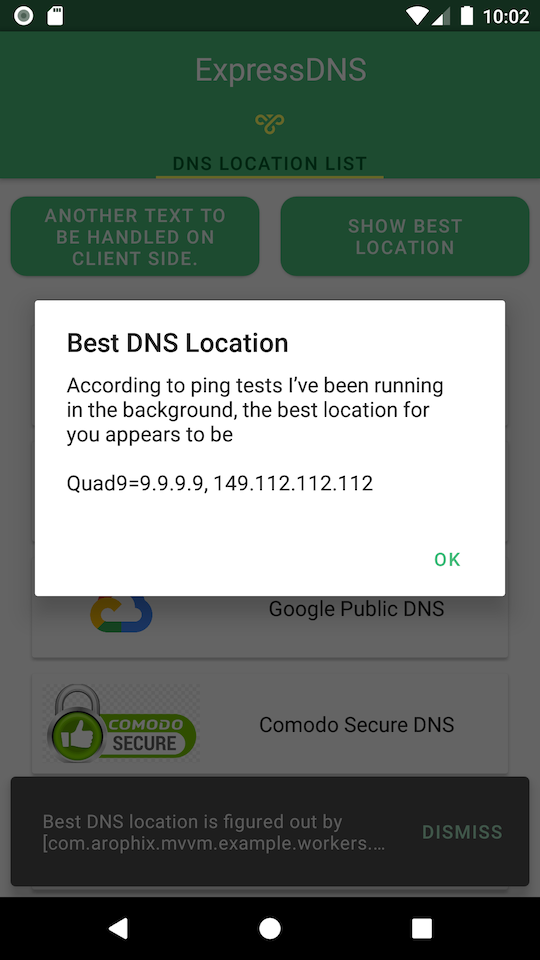
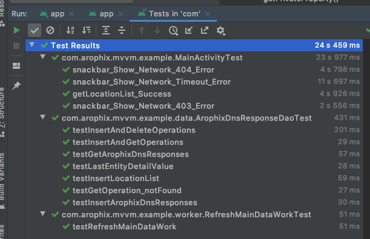
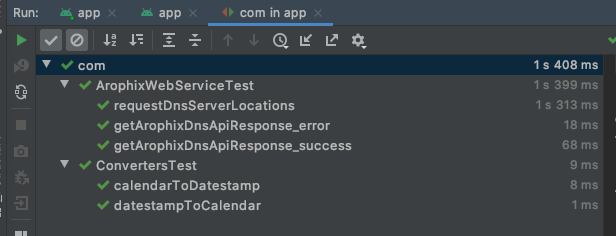

Android MVVM Architecture Example
=================

This app is purely implemented using Kotlin.

This app is to test DNS servers and figure out the best / fastest DNS server (https://www.techradar.com/sg/news/best-dns-server)

About application architecture
---

1. Using MVVM architecture + Repository pattern based on Android architectural components, i.e. **Room**, **LiveData**, **ViewModel**.
2. Web service is based on **Retrofit** library.
3. Database acts as the single source of truth for updating UI widgets, i.e. refresh button and location list.
4. Manual dependency injection is adopted using `InjectorUtils` as it can achieve my goals more easily.

About testing strategy
---

- Separate tests into unit tests and instrumentation tests.

    - Dao tests and webservice api tests are purely done in unit tests.
    - UI tests are done in Android instrumented tests.

- Custom test runner created for Retrofit to inject testing end point instead of using real end point.

- For manual tests

    - Switch off your device network, an error message *“Network call has failed for a following reason: xxxxx”*
    - Click on the refresh button (left side button), each click will trigger an web service API call and refresh the list and button. The Arophix mock server will always return the same set of XML data, in order to demonstrate that the server data changes of each API call, I intercept the **ButtonText** by appending a UUID string and display it on the button per each click. Please forgive the urgly **REFRESH** button.

Steps to build, test and install
------------

1. Build apk

    ```bash
    ./gradlew clean
    ./gradlew assembleDebug
    ```

2. Auto test

    ```bash
    ./gradlew testDebugUnitTest
    ./gradlew cAT --info
    ```

3. Install apk to device

    ```bash
    ./gradlew installDebug
    ```

4. Manual test fresh installation (with network connected)
(Already covered in auto test)

    - shall see two buttons with "**REFRESH**" and "**SHOW BEST LOCATION**"
    - Wait for while, the DNS location list shall disaply on screen.

5. Manual test fresh installation (with network disabled)
(Already covered in auto test)
    - Fresh installation, shall see two buttons with "**REFRESH**" and "**SHOW BEST LOCATION**"
    - Network error shall display in snackbar message, i.e. "*Unable to resolve host xxxx*"
    - DNS list shall be empty.

6. Manual test with existing installation
(Already covered in auto test)
    - Click on the button text multiple times, each click will trigger one API call and refresh the button text each time.

Screenshots
--------------

Under folder `screenshots`, you can find some screenshots for cases of

- A list of successfully loaded DNS locations

  

- Best location dialog

  

- Instrumentation test result

  

- Unit test result

  

Other UI behaviors can be oberserved from auto test run

Libraries Used
--------------

- [Foundation][0] - Components for core system capabilities, Kotlin extensions and support for
  multidex and automated testing.

    - [AppCompat][1] - Degrade gracefully on older versions of Android.
    - [Android KTX][2] - Write more concise, idiomatic Kotlin code.
    - [Test][4] - An Android testing framework for unit and runtime UI tests.

- [Architecture][10] - A collection of libraries that help you design robust, testable, and
  maintainable apps. Start with classes for managing your UI component lifecycle and handling data
  persistence.

    - [Data Binding][11] - Declaratively bind observable data to UI elements.
    - [Lifecycles][12] - Create a UI that automatically responds to lifecycle events.
    - [LiveData][13] - Build data objects that notify views when the underlying database changes.
    - [Room][16] - Access your app's SQLite database with in-app objects and compile-time checks.
    - [ViewModel][17] - Store UI-related data that isn't destroyed on app rotations. Easily schedule
       asynchronous tasks for optimal execution.
    - [WorkManager][18] - Manage your Android background jobs.

- [UI][30] - Details on why and how to use UI Components in your apps - together or separate

    - [Animations & Transitions][31] - Move widgets and transition between screens.
    - [Fragment][34] - A basic unit of composable UI.
    - [Layout][35] - Lay out widgets using different algorithms.

- Third party
  
    - [Kotlin Coroutines][91] for managing background threads with simplified code and reducing needs for callbacks

[0]: https://developer.android.com/jetpack/components
[1]: https://developer.android.com/topic/libraries/support-library/packages#v7-appcompat
[2]: https://developer.android.com/kotlin/ktx
[4]: https://developer.android.com/training/testing/
[10]: https://developer.android.com/jetpack/arch/
[11]: https://developer.android.com/topic/libraries/data-binding/
[12]: https://developer.android.com/topic/libraries/architecture/lifecycle
[13]: https://developer.android.com/topic/libraries/architecture/livedata
[16]: https://developer.android.com/topic/libraries/architecture/room
[17]: https://developer.android.com/topic/libraries/architecture/viewmodel
[18]: https://developer.android.com/topic/libraries/architecture/workmanager
[30]: https://developer.android.com/guide/topics/ui
[31]: https://developer.android.com/training/animation/
[34]: https://developer.android.com/guide/components/fragments
[35]: https://developer.android.com/guide/topics/ui/declaring-layout
[91]: https://kotlinlang.org/docs/reference/coroutines-overview.html

Misc
----

A **MockWebServer** bug was found during my implementation and testing. I asked one question [java.lang.IllegalArgumentException: Log tag “okhttp3.mockwebserver.MockWebServer” exceeds limit of 23 characters](https://stackoverflow.com/questions/63387807/java-lang-illegalargumentexception-log-tag-okhttp3-mockwebserver-mockwebserver) in stackoverflow. The bug was confirmed by the author of **MockWebServer**.

I have provided my own fix to the bug which unblocked myself from completing the tests.

[Pull-request 6229](https://github.com/square/okhttp/pull/6229) for bug fix has been approved and merged with [Square Okhttp](https://github.com/square/okhttp) master branch.

TODOS
----

- Setup Go lang server (or python server? or nodejs? or J2EE?)
- Add DNS details screen
- Implement details screen using Android `Compose`
- Implement Navigation controller
- Add `flow`
- Add `page`
- Add `Dagger`/`Hilt`
- Implement simple best location based on distance from current location  
- Add notifications when best location is computed.
